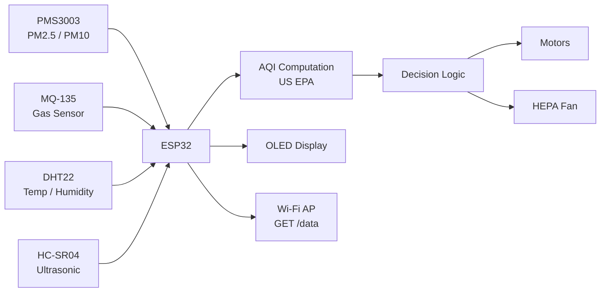
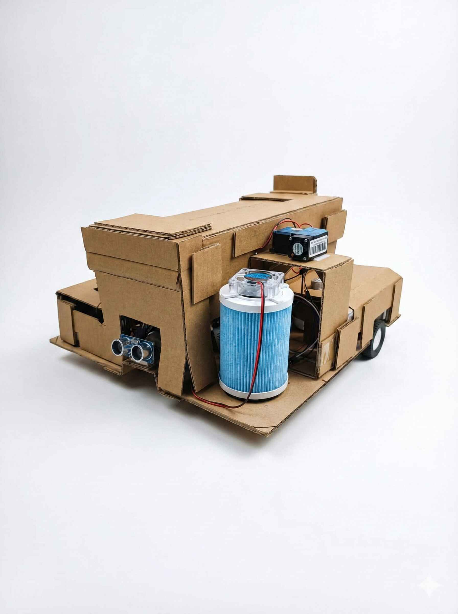
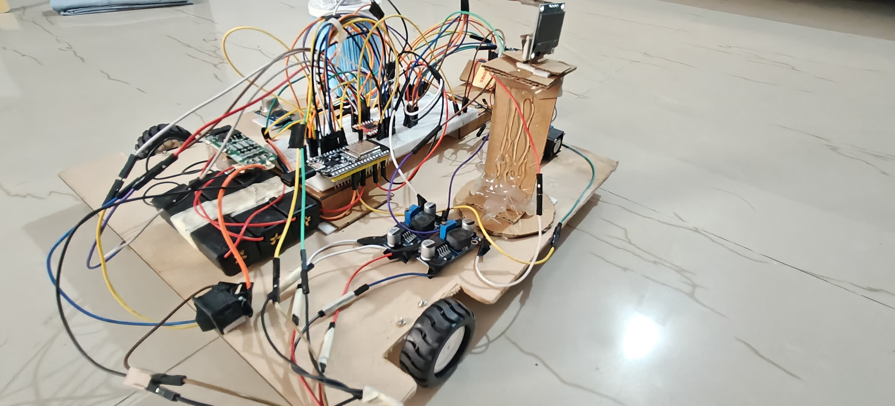
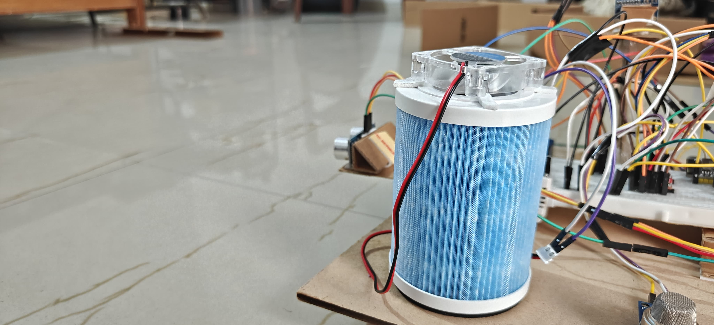
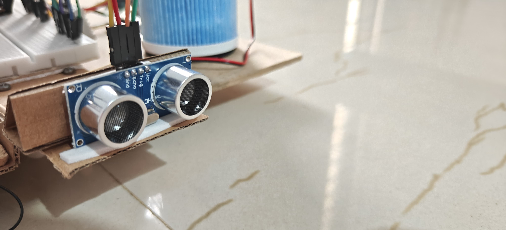
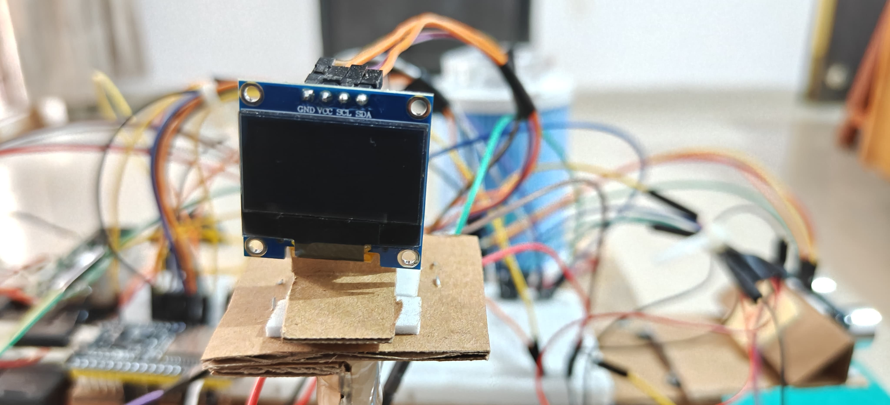

# Vayu-X — Smart Autonomous Air-Quality Robot

Vayu-X is an **ESP32-based autonomous mobile robot** designed to **monitor indoor air quality and actively purify polluted zones** using deterministic, rule-based control.

The system navigates an environment, evaluates air quality using particulate and gas sensors, and **automatically halts movement to perform purification** when unhealthy conditions are detected.

> ⚙️ Built as a real embedded system — explainable, predictable, and demo-ready.

---

## 🚀 Project Highlights

- Fully autonomous operation (no remote control required)
- Real-time AQI computation using **US EPA standards**
- Active air purification using **HEPA filtration**
- Obstacle avoidance via ultrasonic sensing
- Deterministic rule-based decision logic (no ML / AI)
- Optional **read-only Android monitoring app**
- ESP32 Wi-Fi AP + HTTP JSON interface

---

## 🧠 Motivation

Indoor air quality often goes unnoticed despite its significant health impact.  
Vayu-X was built to **autonomously explore an environment, identify polluted zones, and respond physically** by purifying the air — without relying on cloud services or human intervention.

The project emphasizes **embedded reliability, explainable behavior, and system safety** over complex prediction models.

---

## 🧩 System Architecture



### Core Components
- **ESP32 (38-pin)** — central controller
- **PMS3003** — PM2.5 / PM10 particulate sensor
- **MQ-135** — gas concentration trend detection
- **DHT22** — temperature & humidity
- **HC-SR04** — obstacle detection
- **TB6612FNG** — motor driver
- **HEPA filter + fan** — purification unit
- **OLED (0.96")** — live system feedback

---

## 🔁 Autonomous Decision Logic

Vayu-X uses **deterministic, threshold-based control** implemented entirely on the ESP32.

### AQI-Based Behavior

| AQI Range | Category | Robot Behavior |
|----------|----------|----------------|
| 0–50 | Good | Normal movement |
| 51–100 | Moderate | Continue movement, increased monitoring |
| ≥101 | Unhealthy or worse | Stop movement & purify air |

When AQI exceeds the threshold:
- Robot **halts immediately**
- Motors are disabled
- HEPA fan is activated
- AQI is re-evaluated periodically
- Movement resumes only after sustained improvement

📄 Full logic explanation:  
➡️ `docs/decision_logic.md`

---

## 📡 Monitoring Interface (Optional)

Vayu-X exposes a **read-only HTTP JSON endpoint** for monitoring.

- ESP32 runs in **Wi-Fi Access Point (AP) mode**
- Phone connects directly to the robot (no internet)
- Android app fetches live data via HTTP

### Endpoint
GET/data


### Data Provided
- AQI (numerical)
- Air quality category
- PM2.5 and PM10 values
- Gas level indicator (MQ-135)
- Temperature
- Humidity

📱 Android app documentation:  
➡️ `app/android/README.md`

> ⚠️ The app cannot control motors or fans — autonomy is enforced by design.

---

## 🖼️ Demo & Prototype Media

### Robot Prototype


### Electronics & Wiring


### HEPA Filtration Unit


### Ultrasonic Obstacle Sensor


### OLED Display


> Note: Minor structural changes were made during iteration (sensor relocation near HEPA intake). Core logic and functionality remain unchanged.

---

## 🗂️ Repository Structure

```markdown
Vayu-X/
├─ firmware/ ESP32 firmware (Arduino)
├─ app/android/ Android monitoring app (Kotlin)
├─ docs/ System architecture & decision logic
├─ hardware/ Schematics & hardware references
├─ demo/ Prototype images & demo media
└─ README.md Project overview
```

---

## ⚙️ How to Run (Quick Demo)

1. Flash ESP32 firmware from `firmware/`
2. Power the robot
3. Connect phone to Wi-Fi network: `Vayu-X`
4. Open Android app
5. Observe live AQI data and autonomous behavior

---

## 🚧 Current Status & Limitations

- Prototype chassis (cardboard) — functional, not final
- Single-zone purification logic
- No battery telemetry exposed
- No cloud logging or remote access

These limitations were **intentional** to maintain system simplicity and reliability.

---

## ❌ Why No Machine Learning?

ML was deliberately excluded because:
- Decisions are threshold-based and explainable
- Training data is environment-specific
- Embedded constraints favor deterministic logic
- Reliability > prediction for this use-case

Vayu-X is designed as a **robust embedded system**, not a black-box model.

---

## 👤 About the Author

**Himanshu Jha**  
B.Tech Computer Science  
Embedded systems and robotics enthusiast

GitHub: https://github.com/HimanshuJha-2005  
LinkedIn: https://www.linkedin.com/in/himanshu-jha-728834337

---

## 🏁 Final Note

Vayu-X demonstrates how **clear decision logic, embedded constraints, and physical actuation** can be combined to solve real-world problems — without unnecessary complexity.

Built to be **understood, demonstrated, and trusted**.

    ESP --> OLED[OLED Display]
    ESP --> WIFI[Wi-Fi AP<br/>JSON /data]
